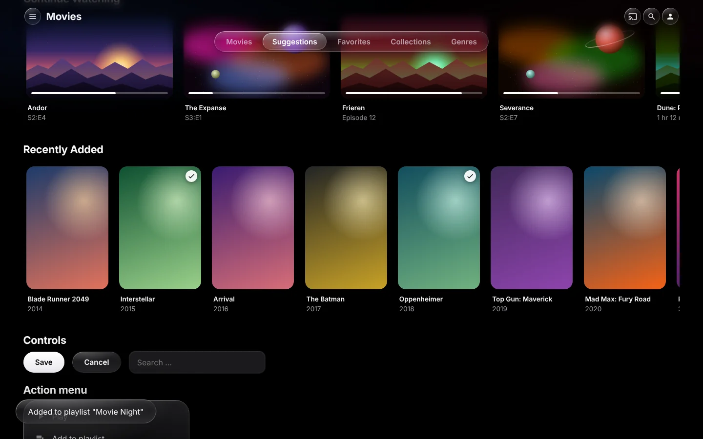

# Jellyos – Apple TV-style theme for Jellyfin

A custom CSS theme for the Jellyfin web client in the style of Apple TV
(tvOS 26) with **Liquid Glass**: floating glass capsules with rim light and
sheen, a soft blur under the header, cards with a glass edge and light sweep
on focus, and springy animations.



| Detail page | Player |
|---|---|
|  |  |

- Pure CSS – no plugin, no JavaScript required
- The font (Inter) ships with the repo, no requests to Google Fonts
- Apple devices automatically use SF Pro
- Supports Jellyfin's desktop, mobile and TV layouts
- Respects "Reduce motion" and "Reduce transparency"

Target: **Jellyfin 10.9 and newer**, standard layout of the web client.

## Liquid Glass – what's inside

| Element | Implementation |
|---|---|
| Tab bar | centered glass capsule, active tab as a bright glass bubble |
| Header | content blurs softly underneath (scroll edge like iOS 26), buttons as glass circles |
| Cards | on focus/hover: lift, glass edge, sheen and a one-time light sweep |
| Card overlay | white play capsule in the center, compact glass buttons at the bottom right |
| Detail page | large backdrop with a fade, glass buttons right on the image, "Play" as milky white glass |
| Panels | side menu, dialogs, action menus, toasts, music bar |
| Player | controls as a floating glass surface over the video |
| Buttons | capsules that give way with a spring when pressed |

The glass consists of four layers: blur with a color boost of the background,
a light tint for readability, a sheen at the top left and rim light. Real
refraction at the edges (as on Apple devices) is not possible cross-browser
with pure CSS.

## Installation

Jellyfin → **Dashboard → General → Custom CSS code**, add one of the
following options, save and reload the page with **Ctrl + F5**.

### Option A: via jsDelivr (easiest)

```css
@import url("https://cdn.jsdelivr.net/gh/Lua-x/Jellyos-jellyfin-theme@1.1.3/theme/apple-tv.css");
```

Always pin a release tag (`@1.1.3`) rather than `@main` – jsDelivr caches
`@main` for a while, so changes arrive with a delay.

### Option B: self-hosted (no third parties)

Put the `theme/` **and** `fonts/` folders on your own web server (e.g. nginx
in your homelab) and keep the folder structure:

```
https://your-server/jellyfin-theme/theme/apple-tv.css
https://your-server/jellyfin-theme/fonts/inter-latin-wght-normal.woff2
```

```css
@import url("https://your-server/jellyfin-theme/theme/apple-tv.css");
```

The font is loaded relative to the CSS file. If the server is on a different
host than Jellyfin, it must allow CORS for fonts
(`Access-Control-Allow-Origin`).

## Customizing

All colors, radii and effects are variables at the top of the file. Override
them in the Jellyfin field **below** the `@import`:

```css
@import url("…/apple-tv.css");

:root {
    --tv-ambient: none;        /* pure black instead of ambient light */
    --tv-tint: #30d158;        /* accent color (e.g. green) */
    --tv-focus-scale: 1.05;    /* subtler zoom */
}
```

| Variable | Purpose |
|---|---|
| `--tv-bg` | page background |
| `--tv-ambient` | ambient light behind the pages (`none` = off) |
| `--lg-filter`, `--lg-filter-panel` | glass blur (`none` = off) |
| `--lg-tint`, `--lg-tint-panel` | glass tint (higher = more readable, less glass) |
| `--lg-rim`, `--lg-sheen` | rim light and sheen |
| `--tv-text`, `--tv-text-2` | primary / secondary text |
| `--tv-tint` | accent (links, checkboxes) |
| `--tv-radius-card`, `--tv-radius-dialog` | corner radii |
| `--tv-radius-person` | corner radius of cast & crew portraits |
| `--tv-focus-scale` | zoom on focus/hover |

### Low-end devices

Blur costs GPU power, especially over playing video. If things stutter:

```css
:root {
    --lg-filter: none;
    --lg-filter-panel: none;
    --lg-tint: rgba(44, 44, 48, 0.85);
    --lg-tint-panel: rgba(28, 28, 30, 0.92);
}
```

## Recommended Jellyfin settings

- **Settings → Home:** use landscape images (thumbs) for "Continue Watching"
  and "Recently Added"
- **Settings → Display:** enable backdrops – the glass looks best over images
- **Layout:** Auto, Desktop, Mobile or TV. The "Experimental" layout uses a
  different interface and is only partially covered.

## Troubleshooting

- **Theme doesn't apply:** open the CSS URL directly in the browser. A 404
  means the tag in the link doesn't exist on GitHub (yet) – use an existing
  tag or a commit hash instead (`@<commit-id>`).
- **Changes don't show up:** reload with **Ctrl + F5**; with `@main` wait for
  the jsDelivr cache or use a tag.

## Preview without a server

The `preview/` folder contains three pages that recreate Jellyfin with the
same CSS classes: `index.html` (library with rows, buttons, menu),
`detail.html` (detail page) and `player.html` (video player). Just open them
in a browser. This does not replace testing in a real Jellyfin instance.

## Structure

```
theme/apple-tv.css     The theme (one file, split into sections)
fonts/                 Inter (variable, latin) + license (SIL OFL 1.1)
preview/               Preview pages, placeholder images, screenshots
CLAUDE.md              Notes for further development with Claude Code
```

## Known limitations

- Only applies to clients that use the web client (browser, Jellyfin Media
  Player, Android/iOS app). Native apps such as the Android TV app or
  Swiftfin have their own interface.
- Jellyfin occasionally renames classes between versions. If something
  stops working after an update, check the current class with the developer
  tools (F12).
- Real refraction and a "Top Shelf" hero banner would need JavaScript (e.g.
  via a plugin) and are not part of this theme.
- Older browsers without `backdrop-filter` get opaque instead of glass
  surfaces.

## License

Theme: MIT (see `LICENSE`).
Inter font: SIL Open Font License 1.1 (see `fonts/OFL.txt`).
Icons in the preview: Material Icons (Apache 2.0).
Not affiliated with Apple; "Apple TV", "tvOS" and "Liquid Glass" are
trademarks or designations of Apple Inc.
