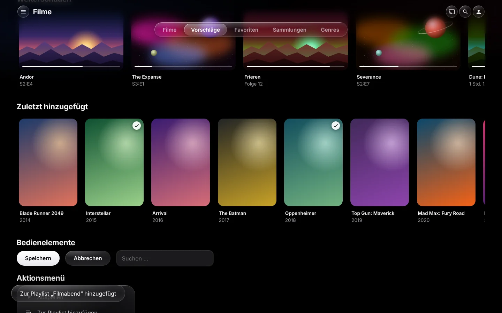
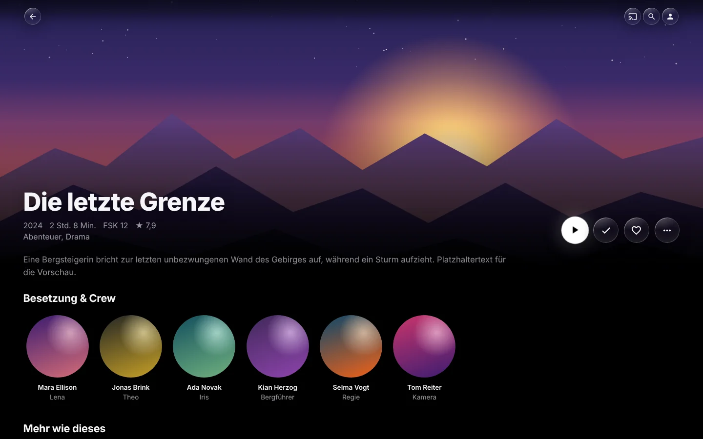
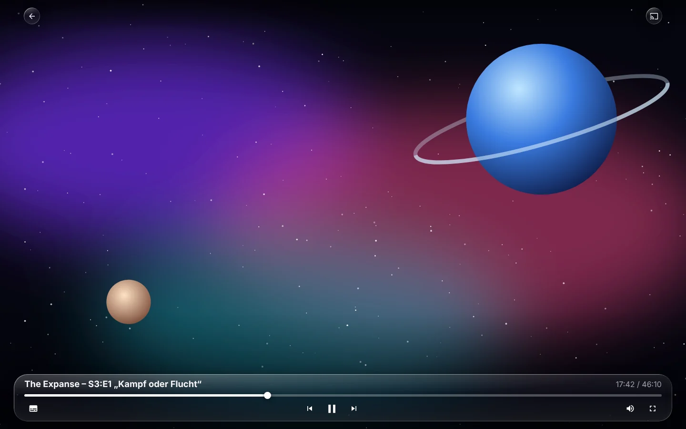

# Jellyos – Jellyfin-Theme im Apple-TV-Stil

Ein Custom-CSS-Theme für den Jellyfin-Web-Client im Stil von Apple TV
(tvOS 26) mit **Liquid Glass**: schwebende Glas-Kapseln mit Lichtkanten und
Glanz, eine weiche Unschärfe unter der Kopfzeile, Karten mit Glaskante und
Lichtstreif bei Fokus und federnde Animationen.



| Detailseite | Player |
|---|---|
|  |  |

- Reines CSS – kein Plugin, kein JavaScript nötig
- Schrift (Inter) liegt im Repo, keine Google-Fonts-Anfragen
- Auf Apple-Geräten wird automatisch SF Pro genutzt
- Desktop-, Mobil- und TV-Layout von Jellyfin werden berücksichtigt
- Respektiert „Bewegung reduzieren“ und „Transparenz reduzieren“

Ziel: **Jellyfin 10.9 und neuer**, Standard-Layout des Web-Clients.

## Liquid Glass – was steckt drin

| Element | Umsetzung |
|---|---|
| Tab-Leiste | zentrierte Glas-Kapsel, aktiver Tab als helle Glas-Blase |
| Kopfzeile | Inhalte verschwimmen weich darunter (Scroll-Kante wie iOS 26), Buttons als Glas-Kreise |
| Karten | Fokus/Hover: anheben, Glaskante, Glanz und einmaliger Lichtstreif |
| Detailseite | großes Backdrop mit Verlauf, Glas-Buttons direkt auf dem Bild, „Abspielen“ als milchig-weißes Glas |
| Panels | Seitenmenü, Dialoge, Aktionsmenüs, Toasts, Musikleiste |
| Player | Steuerung als schwebende Glas-Fläche über dem Video |
| Buttons | Kapseln, die beim Drücken federnd nachgeben |

Das Glas besteht aus vier Schichten: Unschärfe mit Farbverstärkung des
Hintergrunds, eine leichte Tönung für Lesbarkeit, ein Glanz oben links und
Lichtkanten. Echte Lichtbrechung an den Rändern (wie bei Apple) ist mit
reinem CSS nicht browserübergreifend möglich.

## Installation

Jellyfin → **Dashboard → Allgemein → Benutzerdefinierter CSS-Code** und
eine der folgenden Varianten eintragen, dann speichern und die Seite neu laden.

### Variante A: über jsDelivr (am einfachsten)

```css
@import url("https://cdn.jsdelivr.net/gh/Lua-x/Jellyos-jellyfin-theme@v1.1.0/theme/apple-tv.css");
```

Am besten immer einen Tag (`@v1.1.0`) statt `@main` verwenden – jsDelivr
hält `@main` eine Weile im Cache, Änderungen kommen dann verzögert an.

### Variante B: selbst gehostet (ohne Drittanbieter)

Den Ordner `theme/` **und** `fonts/` auf einen eigenen Webserver legen
(z. B. nginx im Homelab), sodass die Struktur erhalten bleibt:

```
https://dein-server/jellyfin-theme/theme/apple-tv.css
https://dein-server/jellyfin-theme/fonts/inter-latin-wght-normal.woff2
```

```css
@import url("https://dein-server/jellyfin-theme/theme/apple-tv.css");
```

Die Schrift wird relativ zur CSS-Datei geladen. Bei einem anderen Host als
Jellyfin muss der Webserver CORS für Schriften erlauben
(`Access-Control-Allow-Origin`).

## Anpassen

Alle Farben, Radien und Effekte stehen als Variablen am Anfang der Datei.
Eigene Werte einfach **unter** dem `@import` im Jellyfin-Feld überschreiben:

```css
@import url("…/apple-tv.css");

:root {
    --tv-ambient: none;        /* reines Schwarz statt Umgebungslicht */
    --tv-tint: #30d158;        /* Akzentfarbe (z. B. Grün) */
    --tv-focus-scale: 1.05;    /* dezenterer Zoom */
}
```

| Variable | Bedeutung |
|---|---|
| `--tv-bg` | Seitenhintergrund |
| `--tv-ambient` | Umgebungslicht hinter den Seiten (`none` = aus) |
| `--lg-filter`, `--lg-filter-panel` | Unschärfe des Glases (`none` = aus) |
| `--lg-tint`, `--lg-tint-panel` | Tönung des Glases (höher = besser lesbar, weniger Glas) |
| `--lg-rim`, `--lg-sheen` | Lichtkanten und Glanz |
| `--tv-text`, `--tv-text-2` | Primär- / Sekundärtext |
| `--tv-tint` | Akzent (Links, Checkboxen) |
| `--tv-radius-card`, `--tv-radius-dialog` | Eckenradien |
| `--tv-focus-scale` | Zoom bei Fokus/Hover |

### Schwache Geräte

Unschärfe kostet Grafikleistung, vor allem über laufendem Video. Wenn es
ruckelt:

```css
:root {
    --lg-filter: none;
    --lg-filter-panel: none;
    --lg-tint: rgba(44, 44, 48, 0.85);
    --lg-tint-panel: rgba(28, 28, 30, 0.92);
}
```

## Empfohlene Jellyfin-Einstellungen

- **Einstellungen → Startseite:** bei „Weiterschauen“ und „Zuletzt
  hinzugefügt“ Querformat-Bilder (Thumbs) verwenden
- **Einstellungen → Anzeige:** Hintergründe (Backdrops) aktivieren – das
  Glas wirkt am besten über Bildern
- **Layout:** Automatisch, Desktop, Mobil oder TV. Das Layout
  „Experimentell“ nutzt eine andere Oberfläche und wird nur teilweise erfasst.

## Vorschau ohne Server

Im Ordner `preview/` liegen drei Seiten, die Jellyfin mit denselben
CSS-Klassen nachbauen: `index.html` (Bibliothek mit Reihen, Buttons, Menü),
`detail.html` (Detailseite) und `player.html` (Videoplayer). Einfach im
Browser öffnen. Das ersetzt keinen Test im echten Jellyfin.

## Aufbau

```
theme/apple-tv.css     Das Theme (eine Datei, in Abschnitte gegliedert)
fonts/                 Inter (variabel, latin) + Lizenz (SIL OFL 1.1)
preview/               Vorschau-Seiten, Platzhalterbilder, Screenshots
CLAUDE.md              Hinweise für die Weiterentwicklung mit Claude Code
```

## Bekannte Grenzen

- Wirkt nur in Clients, die den Web-Client nutzen (Browser, Jellyfin Media
  Player, Android-/iOS-App). Native Apps wie die Android-TV-App oder Swiftfin
  bringen ihre eigene Oberfläche mit.
- Jellyfin ändert Klassennamen gelegentlich zwischen Versionen. Wenn nach
  einem Update etwas nicht greift, mit den Entwicklertools (F12) die aktuelle
  Klasse prüfen.
- Echte Lichtbrechung und ein „Top Shelf“-Hero-Banner bräuchten JavaScript
  (z. B. über ein Plugin) und sind nicht Teil dieses Themes.
- Ältere Browser ohne `backdrop-filter` bekommen deckende statt gläserne
  Flächen.

## Lizenz

Theme: MIT (siehe `LICENSE`).
Schrift Inter: SIL Open Font License 1.1 (siehe `fonts/OFL.txt`).
Icons in der Vorschau: Material Icons (Apache 2.0).
Nicht mit Apple verbunden; „Apple TV“, „tvOS“ und „Liquid Glass“ sind Marken
bzw. Bezeichnungen von Apple Inc.
